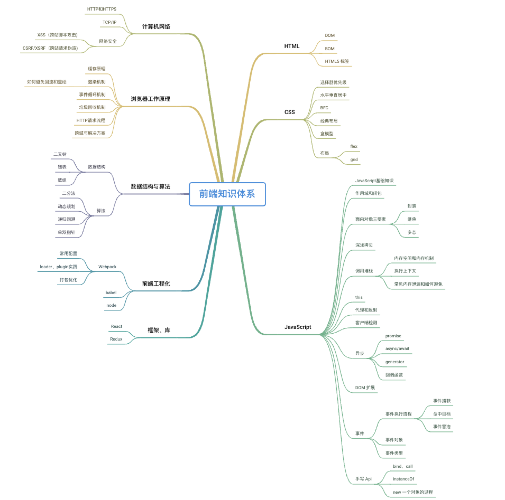

# 饮东的前端知识体系学习

这是饮东整理的前端知识体系学习, 这段时间会逐步整理更新

通过网络受到许多优秀笔者所作文章的帮助，于是把自己的学习心得和路线分享出来，盼共同成长

### JavaScript

#### 基础系列：

- [红宝书--一书读懂基础不愁](./JavaScript/红宝书)
- [红宝书--精读笔记（包含读书随笔）](https://github.com/reonce/notes-and-essays/issues)

#### 手写系列：

- [比较两个对象是否全等](./JavaScript/手写系列/比较两个对象是否全等.md)
- [深拷贝](./JavaScript/手写系列/深拷贝.md)
- [多异步任务保持 3 个并发](./JavaScript/手写系列/多异步任务保持3个并发.md)
- [ES5 实现 let 与 const 的 polyfill](./JavaScript/手写系列/ES5实现let与const.md)
- [实现一个可链式调用、可等待执行的类](./JavaScript/手写系列/实现一个可链式调用、可等待执行的类.md)

### CSS

- [水平垂直居中](./CSS/水平垂直居中.md)
- [选择器优先级](./CSS/选择器优先级.md)
- [BFC](./CSS/BFC.md)

### 框架&库

- [Redux 实现原理](./框架&库/Redux实现原理.md)
- [React 技术揭秘](https://react.iamkasong.com/) 作者卡颂，在线免费读
- [react-use](https://streamich.github.io/react-use/?path=/story/components-usekey--demo) 最推荐的 `hook` 库，官网 `demo` 做的太棒了，结合源码阅读和调试都十分便利，需要挑着看，很多也只是实现 `JavaScript `或 `DOM `的 `API`
- **React 设计原理** 推荐卡颂的新书 《React 设计原理》 （摒弃国人书籍偏见，他写的真的很好）

### 性能优化

- [列举一些网站优化的方法](./性能优化/网站优化的方法.md)
- [性能优化目的、分析和方法](./性能优化/性能优化目的、分析和方法.md)
- [虚拟列表及实现原理](./性能优化/虚拟列表.md)

### 计算机网络

- [常见攻击方式(XSS 与 CSRF)](./计算器网络/常见攻击方式.md)
- [HTTPS 为什么让数据传输更安全](./计算机网络/HTTPS为什么让数据传输更安全.md)
- [HTTP1 和 HTTP2 的区别](./计算机网络/HTTP1和HTTP2的区别.md)
- [三次握手与四次挥手](./计算机网络/三次握手与四次挥手.md)

### 思考与感悟

- [曼巴学习法](./思考与感悟/曼巴学习法.md)
- [时间管理与冥想](./思考与感悟/时间管理与冥想.md)
- [购物纠结时应该如何抉择](./思考与感悟/购物纠结时应该如何抉择.md)
- [预估业务错误引发的思考](./思考与感悟/预估业务错误引发的思考.md)

### 笔者读过且推荐的一些书籍

- 《JavaScript 高级程序设计 第四版》 红宝书，前端圣经
- 《你不知道的 JavaScript》 上中下三册，经常看到有人只推荐下册，这里我读完之后觉得三册都有必要读，并且下册的内容很多都引用了上中册的内容，不要人云亦云，有时间建议都读
- 《JavaScript 语言精粹》 很薄，我是一周读完的，内容有些比较老的内容，能帮助理解 `JavaScript` 的发展，提高对 `JavaScript` 语言的兴趣
- 《JavaScript 权威指南》犀牛书，其实笔者读这本比较少，有点像字典，适合碎片时间翻阅
- 《React 设计原理》 笔者才开始读，目录排版内容满足了我对 React 想要了解的一切，后续读完来补充评价
